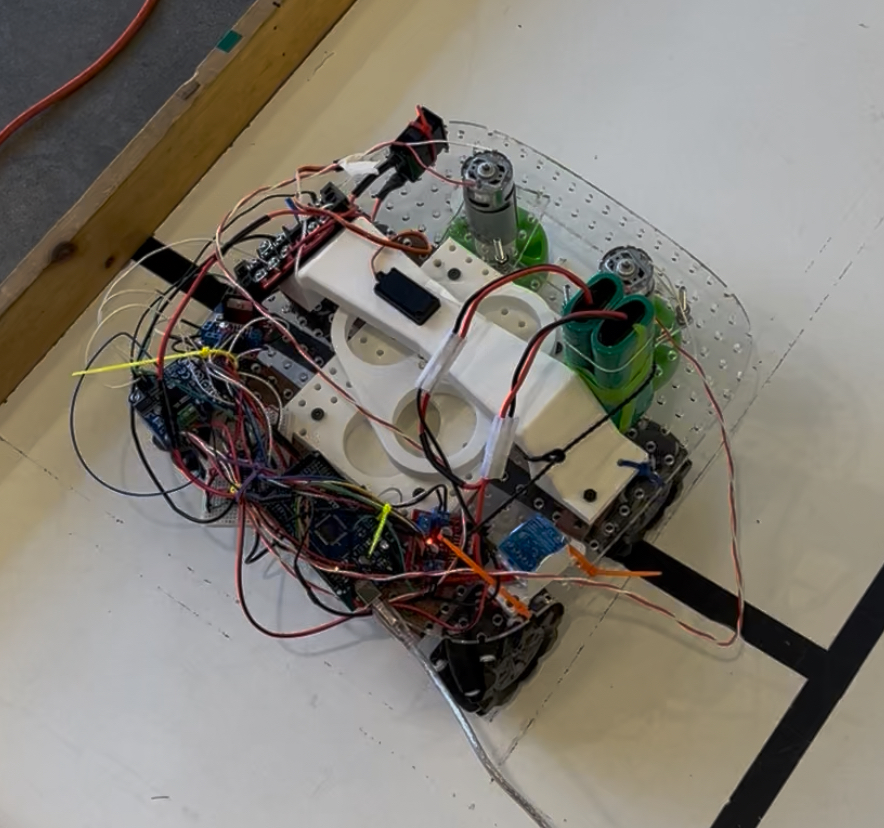

# ME210 — Autonomous Curling Robot

Portfolio website for our ME210 (Introduction to Mechatronics) autonomous curling robot project.

## File Structure

```
me210-website/
├── index.html     Single-page site with all five sections
├── styles.css     Custom styles (placeholders, code theme, scroll behavior)
├── main.js        Mobile menu toggle and scroll-spy for active nav
├── assets/        Drop your images, videos, and 3D models here
└── README.md      This file
```

## Quick Start

1. Open `index.html` in a browser — everything works locally with no build step.
2. Replace placeholder content (see the Customization Guide below).
3. Push to GitHub and enable **GitHub Pages** to deploy.

## Customization Guide

### Images & Videos

Every placeholder is a gray dashed box with a label. To swap one in:

1. Place your image in the `assets/` folder.
2. Find the matching placeholder `<div class="placeholder-box ...">` in `index.html`.
3. Replace the entire `<div>` with an `` tag. Each placeholder has a comment right above it showing the exact tag to use. For example:

```html

```

### 3D CAD models (`.glb`)

The Mechanical section loads **three** parts: `chassis.glb`, `SpeedMotorCoupler.glb`, and `Puck wheel launcher.glb` (spaces in filenames use `%20` in `src`, e.g. `Puck%20wheel%20launcher.glb`).

- The **large viewer** at the top has buttons to switch models; behavior is handled in `main.js`.
- The **three cards** below each embed a `<model-viewer>` for the same files.

To add a **single full-robot assembly** later, export one `robot.glb` into `assets/`, set `id="cad-model-main"` `src` to that file, and add another `<button class="cad-tab" ...>` in `#cad-model-tabs` with `data-cad-src` and `data-cad-alt`.

### KiCad / electrical images

Electrical slots use `assets/kicad.png` (schematic export) and `assets/motordriver high current.jpg`. Export additional PNGs from KiCad for dedicated “power only” or “wiring only” figures and update the corresponding `` paths in `index.html`.

### Team Members

Edit the cards in the `#team` section. Replace the name, role, and swap the avatar `<div>` for an `` tag with a photo.

### Code Blocks

The Software section has two dark-themed code blocks with placeholder Arduino snippets. Paste your real code directly into the `<code>` tags.

## Deploying to GitHub Pages

1. Push all files to the `main` branch of your repository.
2. Go to **Settings → Pages** in your GitHub repo.
3. Under **Source**, select **Deploy from a branch**.
4. Choose `main` branch and `/ (root)` folder, then click **Save**.
5. Your site will be live at `https://<username>.github.io/me210-website/` within a minute.

## Tech Stack

| Tool | Purpose |
|------|---------|
| HTML5 | Semantic page structure |
| Tailwind CSS (CDN) | Utility-first styling, no build step |
| Vanilla JavaScript | Mobile menu, scroll-spy |
| Google Model Viewer | Interactive 3D CAD visualization |
